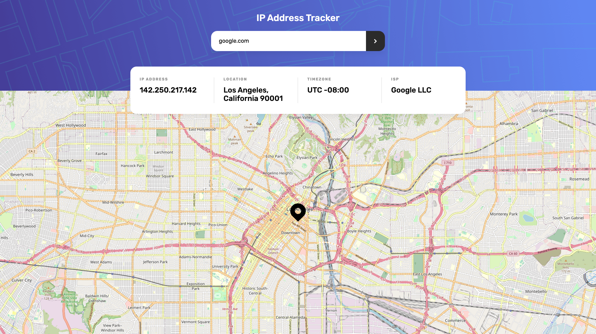

# Frontend Mentor - IP address tracker solution

This is a solution to the [IP address tracker challenge on Frontend Mentor](https://www.frontendmentor.io/challenges/ip-address-tracker-I8-0yYAH0). Frontend Mentor challenges help you improve your coding skills by building realistic projects. 

## Table of contents

- [Frontend Mentor - IP address tracker solution](#frontend-mentor---ip-address-tracker-solution)
  - [Table of contents](#table-of-contents)
  - [Overview](#overview)
    - [The challenge](#the-challenge)
    - [Screenshot](#screenshot)
    - [Links](#links)
  - [My process](#my-process)
    - [Built with](#built-with)
    - [What I learned](#what-i-learned)
  - [Author](#author)


## Overview

### The challenge

Users should be able to:

- View the optimal layout for each page depending on their device's screen size
- See hover states for all interactive elements on the page
- See their own IP address on the map on the initial page load
- Search for any IP addresses or domains and see the key information and location

### Screenshot



### Links

- Live Site URL: [ip-tracker.kimdanielkoch.de](https://ip-tracker.kimdanielkoch.de)

## My process

### Built with

- [React](https://reactjs.org/) - JS library
- [Next.js](https://nextjs.org/) - React framework
- [Styled Components](https://github.com/css-modules/css-modules) - For styles
- [React Leaflet](https://react-leaflet.js.org/) - Map Component

### What I learned

I decided to use Next.js and it's simple API implementation to request the external API to retrieve the location data without exposing my API key to the end user.
Pages are pre-rendered in Next.js by default to improve performance and improve SEO. I had to disable this feature for th "Map" component because it depends on the window object. Because of this I got a "window is not defined" error. I learned that you can disable this by explicitly lazy loading the component with the "ssr:false" parameter


```js
const MapNoSSR = dynamic(() => import("../components/Map/Map"), { ssr: false });
```
## Author

- Website - [kimdanielkoch.de](https://www.kimdanielkoch.de)
- Frontend Mentor - [@Kimbo0o](https://www.frontendmentor.io/profile/Kimbo0o)
